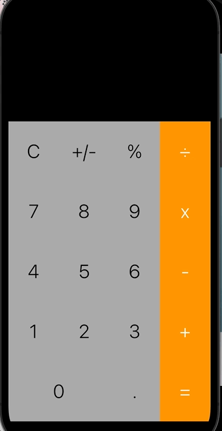

**Working Calculator App Swift Project**  
**By: Ariadne Rincon**  

This is a swift program created during midterm week for my CPSC 411 class. Source code was used for majority of project, with exception of the NegOrPos function that switches input from being a negative or positive number.  
This calculator was designed to replicate the calculator UI presented in our class textbook Big Nerd Ranch Guide, Ch. 3 View Hierarchy.

**Below is a gif to demonstrate the output of the program:**  
  
  

 
